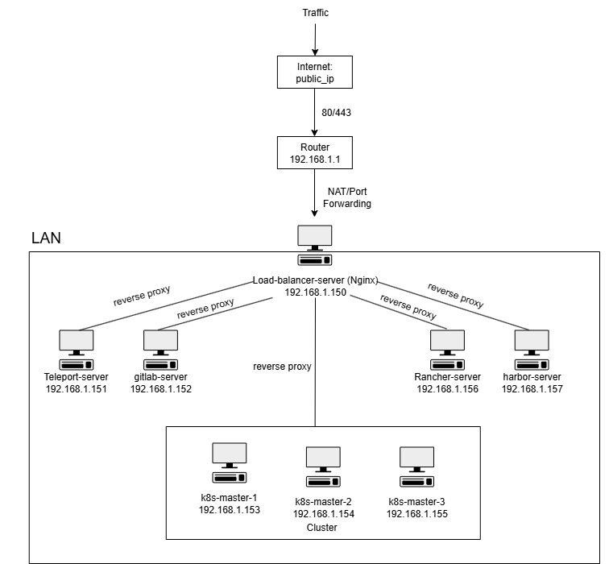

Xây dựng mạng nội bộ bằng công cụ VMWare
Các công cụ: 
 - Load-balancer: nginx
 - Quản lý server: teleport
 - Quản lý source code: gitlab server
 - Quản lý cụm k8s: Rancher server
 - Private registry: harbor
 - Cụm k8s với 3 server vừa là master vừa là worker
 - Đóng gói dự án bằng helm chart

Sơ đồ:

